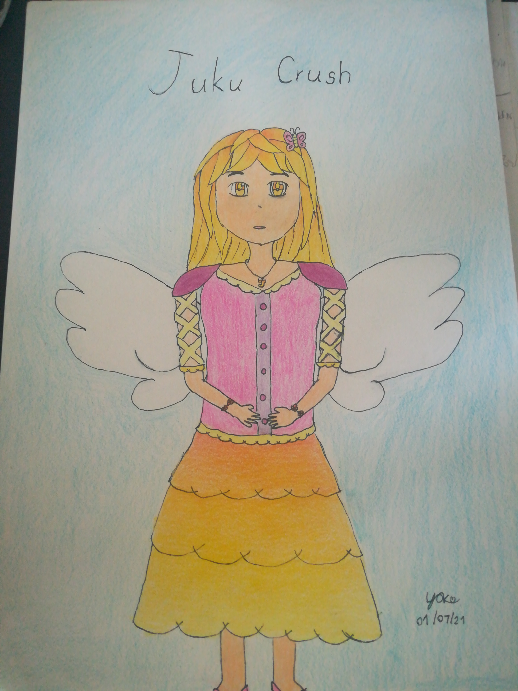
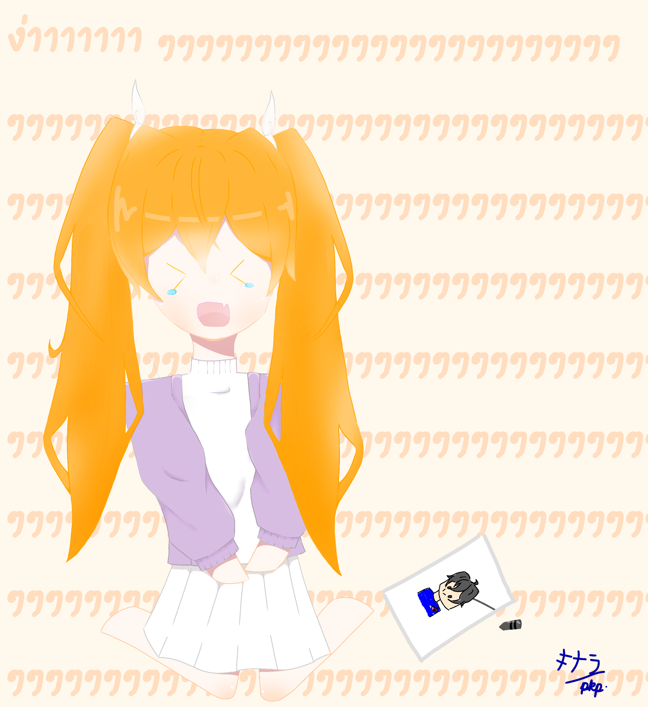
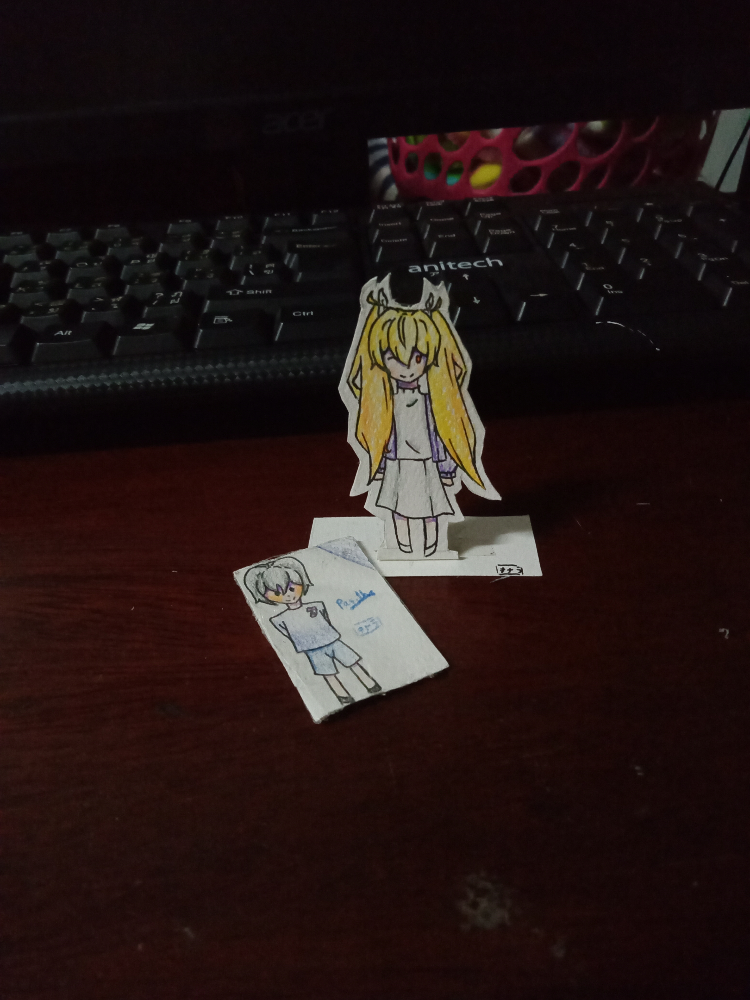

<div align="center">
	<a href="https://www.youtube.com/channel/UC-lNawOSpzmBSO-IqKImcfw"></a><br>
	<a href="https://discord.gg/zmjUh4S"></a>
	<a href="https://web.facebook.com/JukucrushTeam"></a>
	<a href="https://www.youtube.com/c/JukucrushTeam"></a>
	
</div>

# JKC-Discord-Bot
<div float="left">
	
	
</div>
Discord bot for <b>Jukucrush's official discord server</b>

# Project Requirements
[node.js v.16](https://nodejs.org/en/download/current/ "node.js")
discord.js v.13 (will be installed automatically after following step 2 in the "Installation and Setup" part)

## Installation and Setup
1. Clone the project 
	```sh-session
	git clone https://github.com/Pasitha/JKC-Discord-Bot.git
	```
2. Install required dependencies defined by me, Pasitha, in the __package.json__ file 
	```sh-session
	npm install
	```
3. Make sure your bot has __[Privileged Gateway Intents](https://discord.com/developers/applications "Discord Developer Portal")__
4. Set your bot token (required) and minecraft account (optional if you want the commands in the minecraft-commands section to be usable) in the __settings.json__ file (Note : Do not use the commands in the minecraft-commands section if you didn't put in your minecraft account information.)<br>
	<h4><b>Example</b></h4>
	
	```json
	{
  		"token": "TokenGoesHere",
 	 	"prefix": "$",
 		"ownerIDS": ["OwnerDiscordID", "Owner2DiscordID"],
 		"version": "v.0.1.4",
  		"lastrun": "xx/xx",
 		"minecraftid": {
   			"Pasitha": {
				"host": "192.168.1.33",
				"username": "pasitha@example.com",
				"password": "thisisPasithapassword",
				"auth": "microsoft",
				"version": false,
				"plugins": {},
				"hideErrors": true,
				"logErrors": true,
				"loadInternalPlugins": true,
				"client": null,
				"brand": "vanilla",
				"majorVersion": "1.17",
				"protocolVersion": 756,
				"port": 25565,
				"closeTimeout": 120000,
				"noPongTimeout": 5000
    		}
 		}
	}
	```
5. Then, __run__ the script. You can either use
	```sh-session
	npm start
	```
	or
	```sh-session
	node .
	```
	(Open a terminal/ command prompt/ etc. in the bot's folder, or you can make a run.bat file in the bot's folder and then, right-click the 
file select "Edit" and put in either ```npm start``` or ```node .```)
	
## Database Setup
1. __Migration__
 	- ```yarn start:migration```
2. __Studio__
	- ```yarn start:studio```
3. __Update__
	- ```node ./prisma/json2sql.js``` 

## Discord Commands
1. __Help__
	- ```$help``` , the bot will send an embed showing all the commands this bot has.
2. __User Information__
	- ```$info @user```, the bot will send an embed with the mentioned user's information.
	- ```$info```, the bot will send an embed with the user's information.
3. __Jukucrush__
	- ```$jkc```, the bot will send an embed with clickable buttons to Jukucrush Team's Official YouTube Channel, Facebook Page, and also this
very GitHub repository. 
	- ```$jkc ดูไรดี```, the bot will send an embed with a link to a random video, made by Jukucrush Team's members.
4. __Minecraft Skin, Minecraft Head__
	- ```$mcskin minecraftName```, the bot will send the player's minecraft skin back into the channel where the command is used. (Example : 
```$mcskin Pasitha```, the bot will send Pasitha's current minecraft skin.)
	- ```$mchead minecraftName```,  the bot will send the player's minecraft head back into the channel where the command is used. (Example : 
```$mchead Pasitha```, the bot will send Pasitha's current minecraft head.)
5. __My Account__ (Per-Server Data)
	- ```$account```, the bot will send an embed showing how much money you have in your account right now. (Base Amount : 100)
6. __Pay__ (Per-Server Data)
	- ```$pay @user amount```, the bot will transfer the money defined from the user who used the command to the user mentioned in the 
command.
7. __Query (FAQ)__
	- ```$query```, the bot will send an embed, with clickable buttons, showing Jukucrush's FAQs.
8. __Random Number__
	- ```$random```, the bot will randomize a number from __1 to 100__
	- ```$random definedNumber```, the bot will randomize a number from __1__ to __definedNumber__
	- ```$random number1 number2```, the bot will randomize a number from __number1__ to __number2__
9. __Poll__
	- ```$vote question description choice1 choice2 choice3 ... choice10```, the bot will send an embed with clickable reactions to choose 
between options.
10. __Where Is?__ (Made especially for Jukucrush Junior SS.5's members) 
	- ```$whereis locationName```, the bot will send an embed telling the coordinates of that place, both Overworld coordinates and Nether 
coordinates.
	- ```$whereis```, the bot will send an embed showing all the valid location names.
11. __Position__  
	Can only be used in the Jukucrush's Official Discord Server
	- ```$position minecraftName```, ```$pos minecraftName```, the bot will send an embed showing the position of the player defined, 
__minecraftName__, in the Jukucrush Junior SS.5 server.
	- ```$position```, ```$pos```, the bot will send an embed showing the position of the bot itself in the Jukucrush Junior SS.5 server.
12. __Online Players__ 
	Can only be used in the Jukucrush's Official Discord Server
	- ```$onlineplayer```, ```$list```, the bot will send an embed showing a list of online players in the Jukucrush Junior SS.5 server.
13. __Send to Jukucrush Junior__ 
	Can only be used in the Jukucrush's Official Discord Server, and only people with the roles
		1. Jukucrush Member
		2. Jukucrush Junior
		3. Jukuboost
		4. Moderator
	can use this command.
	- ```$sendjr message```, the bot will send the message to the server, Jukucrush Junior SS.5.

## Minecraft Commands
1. __Calculate__ 
	- ```$cal question```, The bot will calculate what you asked, __question__, and send the answer back into the in-game chat.
2. __Position__
	- ```$position minecraftName```, ```$pos minecraftName```, the bot will send the position of the player defined, 
__minecraftName__, in the Jukucrush Junior SS.5 server, back into the in-game chat.
3. __Random Number__
	- ```$random```, the bot will randomize a number from __1 to 100__
	- ```$random definedNumber```, the bot will randomize a number from __1__ to __definedNumber__
	- ```$random number1 number2```, the bot will randomize a number from __number1__ to __number2__
4. __Send to Jukucrush's Official Discord Server__ 
	- ```$sendjkc message```, the bot will send the message to the Discord server, it is used by the Jukucrush Junior Members 
and Jukucrush Members in order to reply to someone who sent message(s) from the Discord server.

## Notification Features
1. __YouTube Notifications__ 
	- The bot will check the feed of the YouTube channels if they have uploaded a video, started a livestream, etc. or not
YouTube channels are defined in [jkc.json](https://github.com/Pasitha/JKC-Discord-Bot/blob/main/index.js#L11-L35 "array youtube channels id ")
2. __Birthday Notifications__ (Jukucrush Members' Birthday only)
	- The bot will check whose birthday today is, and send a Happy Birthday message to the main chat in the Jukucrush's Discord server. 
Birthdays are defined in [jkc.json](https://github.com/Pasitha/JKC-Discord-Bot/blob/b1918d5e10470a529fe3542f6b2c80b588c30bcf/jkc.json#L4)

### Jukkyjung Fan Arts
<div float="left">
	
	
	
  	
	
	
</div>
